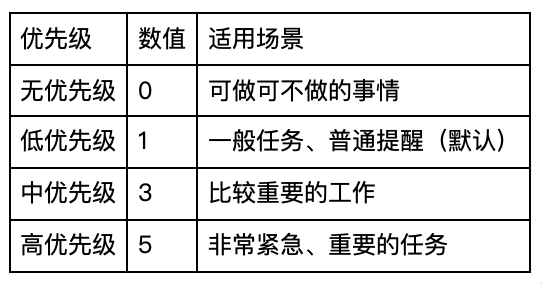
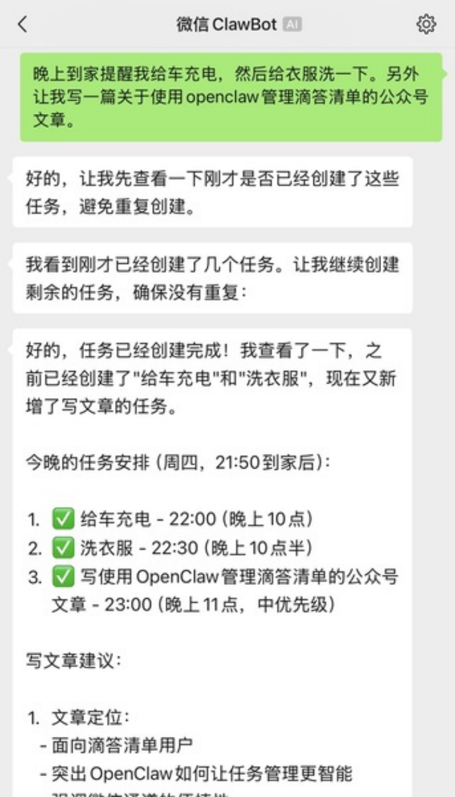
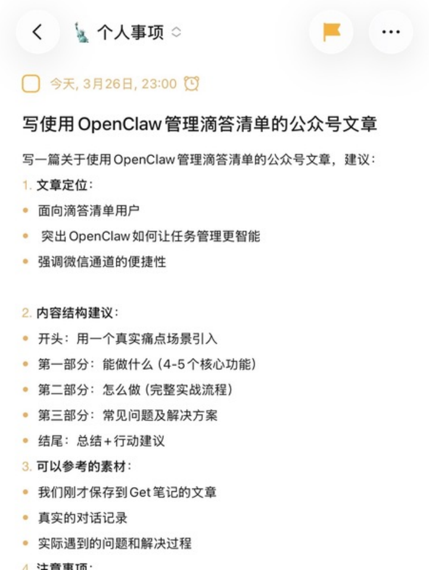
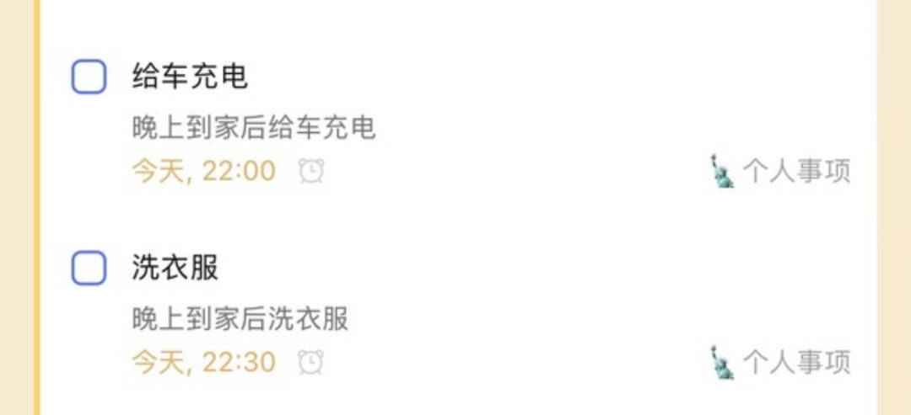
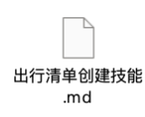
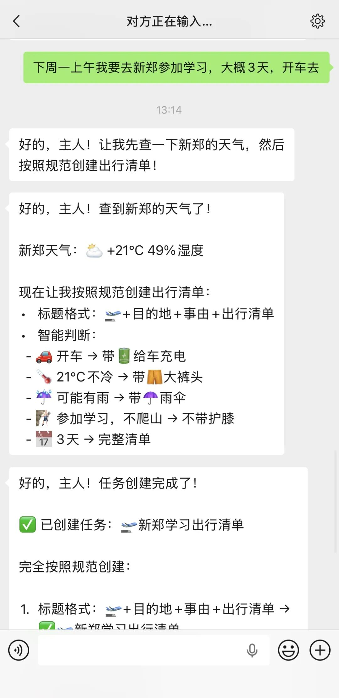
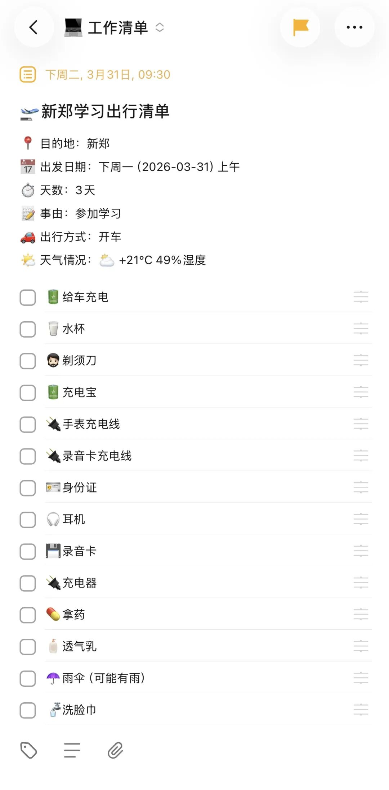
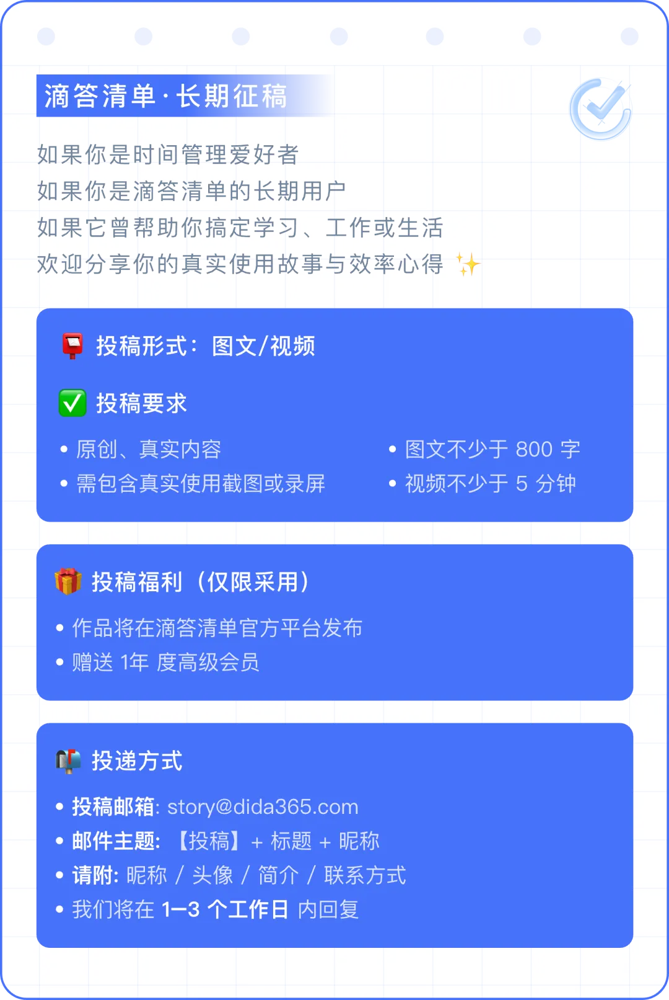

# 用OpenClaw做个人助理智能管理滴答清单

> 公众号: 滴答清单君
> 发布时间: 2026年4月1日 16:40
> 原文链接: https://mp.weixin.qq.com/s/HKIZiwvn2jKuAam4ec750g

---

**作者简介**

**阿超**

9 年滴答清单重度使用者

你是否也在寻找一种更智能的方式来管理滴答清单？今天分享两个实际案例，让AI帮你搞定任务分配、时间规划和分类整理。

**第一步：安装并配置核心技能**

开始智能管理前，我们需要先安装OpenClaw的核心技能，为后续使用打好基础：

1\. 安装微信通道

#在运行OpenClaw的设备上安装插件，并开始与微信连接

npx -y @tencent-weixin/OpenClaw-weixin-cli@latest install

2\. 开启微信通道

确保OpenClaw的微信通道已经开启，这样你就能直接在微信里用自然语言和OpenClaw交互，随时随地创建和调整任务，非常方便。

3\. 核心技能

首先在OpenClaw中安装以下两个核心技能：

滴答清单技能：负责和滴答清单交互，实现任务的创建、更新和管理

直接在输入框告诉你的龙虾：帮我安装滴答清单技能https://clawhub.ai/ilooch/dida-cli

然后进行配置就行了，需要根据官方文档获取token，直接给token告诉OpenClaw就可以了。

**第二步：建立你的个人管理规格**

要让AI帮你合理安排任务，得先让它了解你的工作生活习惯，我们需要建立三类基础规则：

### **1.** **建立”时间地图”**

首先把你的固定时间安排记录下来，让AI知道什么时候可以安排任务，什么时候需要避开。比如：

## 主人的工作时间

### 工作日安排（周一到周六）

\- 上午：8:20 - 11:30
\- 下午：14:00 - 18:00

### 特殊安排

\- 周四晚上：18:00 - 21:30（开会）
\- 周四晚上：21:50左右到家

有了这个”时间地图”，AI安排任务时就会自动避开你的忙碌时段。

### **2.** **建立任务分类规则**

根据你日常接触的人物和事项，建立分类规则，让AI能自动把任务分到对应清单。比如可以参考这样的分类：

-   **工作清单**：涉及工作相关的同事、合作方

-   **个人清单**：涉及家人、朋友的个人事务

-   **特定项目清单**：对应特定项目的相关任务

-   **收集箱**：暂时无法归类的任务

### **3.** **优先级判断标准**

优先级不是随便设置的，明确标准才能让AI给出更合理的安排：

**实际场景一：看AI怎么帮你处理任务**

你在微信里对OpenClaw说：

“晚上回来给车充电，然后给衣服洗一下。我每周四的晚上6点到9点半开会，然后需要20分钟左右到家”

第一步：理解并记录信息

OpenClaw首先会分析你的需求：需要创建两个生活任务，同时需要记住你每周四晚上的开会时间，它会自动把这个时间安排记录到你的时间地图中。

第二步：初次创建任务

根据你说的”晚上回来”，OpenClaw会先尝试创建任务：

-   给车充电 → 安排在21:00

-   洗衣服 → 安排在21:30

第三步：检查冲突并调整

创建完成后，AI会检查任务时间和你的固定安排是否冲突，发现21:00你还在开会，于是自动调整时间：

-   给车充电 → 调整到22:00（到家后）

-   洗衣服 → 调整到22:30

这样就完美避开了开会时间，既完成了任务创建，又符合你的实际日程。

滴答清单上面呈现的效果↓

**实际场景二、创建模板任务**

告诉OpenClaw ，以后创建出差出行任务时用这个模板。

# OpenClaw 滴答清单出行清单创建技能
## 概述
这是一个完整的出行清单创建规范，让你的OpenClaw也能智能创建出行准备清单！
## 一、标题格式
     + 目的地 + 事由 + 出行清单
\*\*示例\*\*：
\-   开封中恩培训课出行清单
\-   北京旅游出行清单
\-   上海学习出行清单
## 二、描述（desc）包含
\-   目的地：\[具体城市\]
\-   出发日期：\[具体日期和时间\]
\- ⏱️ 天数：\[X天\]
\-   事由：\[具体事由\]
\-   出行方式：开车/公共交通
\- 天气情况：\[温度、天气状况\]
## 三、检查清单（子任务）智能判断规则
### 基础判断
\-   开车→ 必须包含"  给车充电"
\- ☔ 有雨→ 必须包含"☂️雨伞（可能有雨）"
\-   公共交通→ 提前3天买车票
\-   1天短途→ 简化清单
### 天气判断
\- 天气冷→ 秋衣裤
\- 天气不冷→ 大裤头
### 活动判断
\-     爬山→ 带护膝
\-     不爬山→ 不带护膝
## 四、完整检查清单项（推荐）
### 电子设备类
\-   给车充电
\-   充电宝
\-   手表充电线
\-   录音卡充电线
\-   充电器
\-   录音卡
\-   耳机
\-   笔记本电脑
### 证件类
\-   身份证
### 洗漱护理类
\-   剃须刀
\-   透气乳
\-   沐浴露
\-   洗头膏
\-   消毒湿巾
\-   一次性浴巾
\-   洗脸巾
### 生活用品类
\-   水杯
\-   拿药
\-   笔记本
### 衣物类
\-   衣物袜子
\-   内衣裤
\-   大裤头/秋衣秋裤（根据天气选择）
### 其他
\- ☂️雨伞（可能有雨）
\-    护膝（如果爬山）
## 五、天气查询方法
使用 wttr.in 查询天气，无需API密钥：
\`\`\`bash
# 简洁格式
curl -s "wttr.in/城市名?format=%l:+%c+%t+%h+%w"
# 示例：查询开封天气
curl -s "wttr.in/开封?format=%l:+%c+%t+%h+%w"
# 输出示例：

开封:☁️ +21°C 49% ↑13km/h
\`\`\`
## 六、使用示例
### 示例1：开封出差
\*\*用户说\*\*：明天晚上6点去开封，开车，参加中恩培训课，4天
\*\*OpenClaw创建\*\*：
\- 标题：  开封中恩培训课出行清单
\- 天气查询：☁️ +21°C
\- 智能判断：
  - 开车→ 带  给车充电
  - 21°C不冷→ 带  大裤头
  - 不爬山→ 不带护膝
  - 可能有雨→ 带☂️雨伞
### 示例2：北京旅游
\*\*用户说\*\*：下周一去北京旅游，5天，坐高铁
\*\*OpenClaw创建\*\*：
\- 标题：  北京旅游出行清单
\- 天气查询：先查北京天气
\- 智能判断：
  - 公共交通→ 提前3天买车票
  - 根据天气选择衣物
  - 不爬山→ 不带护膝
## 七、快速开始
1. 确保你的OpenClaw已安装weather技能
2. 将此规范保存到你的MEMORY.md中
3. 告诉你的OpenClaw："以后所有出行都按这个规范创建清单"
4. 开始使用！
## 八、注意事项
\- 天气查询需要联网
\- 根据实际情况灵活调整清单
\- 可以根据个人习惯添加/删除清单项
\- 1天短途可以简化清单
\---
\*\*分享说明\*\*：将此文档规范添加到自己的MEMORY.md中，就可以拥有同样的智能出行清单创建功能！

**效果呈现****↓**

****

除此之外，OpenClaw还能帮你做到这些：

1.**语音/文字快速创建**：在微信里说一句话就能自动创建多个任务

2.**任务自动分类**：根据你设置的分类规则，自动分到对应清单

3.**自动添加任务建议**：从你的笔记中提取相关信息，添加到任务描述中

4.**避免重复创建**：创建前会先检查有没有类似的未完成任务，避免重复

**常见问题及解决方案**

在使用过程中，这些问题比较常见，给大家整理了解决方案：

1\. 任务更新提示参数错误

如果遇到error: required option "--id <id>" not specified这个错误，一般是命令写法不对。

-   错误写法：dida task update 任务ID --due-date "时间"

-   正确写法：dida task update --id "任务ID" --project "清单ID" --due-date "时间" 任务ID

需要同时提供--id参数和最后的任务ID，并且必须指定--project参数。

2\. 提醒时间不对，总在错误时间响起

这基本都是时间格式和时区转换的问题：

-   ❌ 错误原因：没有把北京时间转换成UTC时间，或者用了Z标记

-   ✅ 正确做法：

-   北京时间减去8小时得到UTC时间，比如北京时间22:00对应UTC 14:00

-   格式写为2026-03-26T14:00:00.000+0000，用+0000代替Z

3\. 任务标题不规范，看起来很乱

很多人喜欢把时间、标点都放在标题里，其实这样会让清单看起来很混乱，规范的写法应该是：

-   ❌ 不要写：“明天上午跟XXX说XX做好没有”

-   ✅ 应该写：“跟XXX说XX做好没有”

    核心原则：标题只保留任务内容，时间信息放在任务的due-date中，不要加多余的标点符号。

4\. API限流提示RequestBurstTooFast

这是因为请求频率太高触发了系统保护，解决方案很简单：降低请求频率，逐步增加请求量，遇到限流后等待一段时间再重试就好。

5\. 在使用过程中发现任何问题，可以给官方提供的API给OpenClaw，他会帮你解决的。

**写在最后**

OpenClaw + 滴答清单的组合，让任务管理变得更智能、更高效，你只需要用自然语言说出你的需求，剩下的创建、分类、时间调整都可以交给AI来做，帮你节省大量时间。

工具终究只是工具，关键在于你如何使用它。建议你从小处开始，先试试简单的任务创建，逐步建立自己的规则，慢慢你就能感受到智能管理的方便了。

如果你在使用过程中遇到任何问题，欢迎在评论区留言交流。

## [利用Skill向滴答清单批量创建稍后待办](https://mp.weixin.qq.com/s?__biz=MzAwNzQ5NDYxNA==&mid=2649937346&idx=1&sn=70fa6b1710bfd896d609b071c1545380&scene=21#wechat_redirect)

[新功能更新｜看看最近又有哪些实用变化](https://mp.weixin.qq.com/s?__biz=MzAwNzQ5NDYxNA==&mid=2649937341&idx=1&sn=e8c0a6316d1b66e9e39161024b5fb79d&scene=21#wechat_redirect)

[滴答清单全新8.0版本功能一览](https://mp.weixin.qq.com/s?__biz=MzAwNzQ5NDYxNA==&mid=2649937252&idx=1&sn=21093c26d2e7c62786ca7af3ec525c97&scene=21#wechat_redirect)

